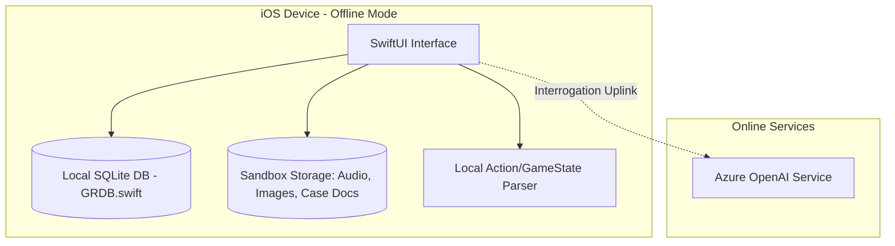

# 🕵️‍♂️ Blackbox Detective

An offline-first, highly immersive iOS forensic and crime scene simulator game. Step into the shoes of an agency investigator: decrypt classified case files, trace evidence on an interactive corkboard, query municipal databases, filter raw wiretap audio, and interrogate suspects using live AI uplinks.

---

## 📸 Core Features

*   📂 **Case Dossier**: Review case files, profiles of suspects, and evidence logs. Decrypt files locally as you discover clues.
*   🧵 **Corkboard**: A zoomable, freeform 2D canvas where you can drag and drop clue cards, draw linking red strings (hypotheses), and attach detective notes.
*   🖳 **Intel Database**: Search citizen registries, vehicle registrations, and cellular communications log archives using a green-on-black terminal.
*   🎛️ **Signal Analyzer**: Play wiretaps and toggle active acoustic filters (High-Pass, De-Noise, Vocal Isolation) to expose background environmental cues (like railway schedules).
*   ⌨️ **Decryption Minigame**: A Fallout-style password guesser. Decrypt corrupted memory blocks to unlock key evidence files in SQLite.
*   🎙️ **Interrogation Room**: Conduct real-time interrogations with suspect personas. Features a strict question count limit. Configures directly to your Azure OpenAI endpoint.

---

## 🏗️ Architecture & Technology Stack

*   **UI Framework**: SwiftUI (Responsive layouts adapting between iPhone bottom tabs and iPad/Mac SplitViews).
*   **Local Storage**: [GRDB.swift](https://github.com/groue/GRDB.swift) (Optimized, type-safe SQLite database manager).
*   **Remote AI Services**: Azure OpenAI API (GPT-4o) with structured system prompt architectures.

---

## 🛠️ Getting Started

### 📋 Prerequisites
*   macOS running **Xcode 14.3+** OR **Swift Playgrounds 4.4+**
*   iOS 16.0+ SDK target

### 🚀 Running the Project
1. Clone or open the folder `BlackboxDetective.swiftpm` in Xcode or Swift Playgrounds.
2. Swift Package Manager will automatically resolve and download the `GRDB.swift` dependency.
3. Build and Run on your iOS Simulator or physical device.

### 🔑 Configuring Azure OpenAI
To activate live suspect interrogations:
1. Navigate to the **Interrogation** tab in the app.
2. Tap the **Gear Icon** in the top-right corner.
3. Input your Azure OpenAI Endpoint URL, API Key, and Deployment Name.
4. Save the configuration to establish the secure uplink.

*(Note: If unconfigured, the suspect interrogation panel is automatically locked for safety security).*
