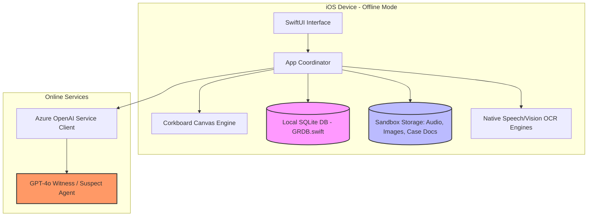
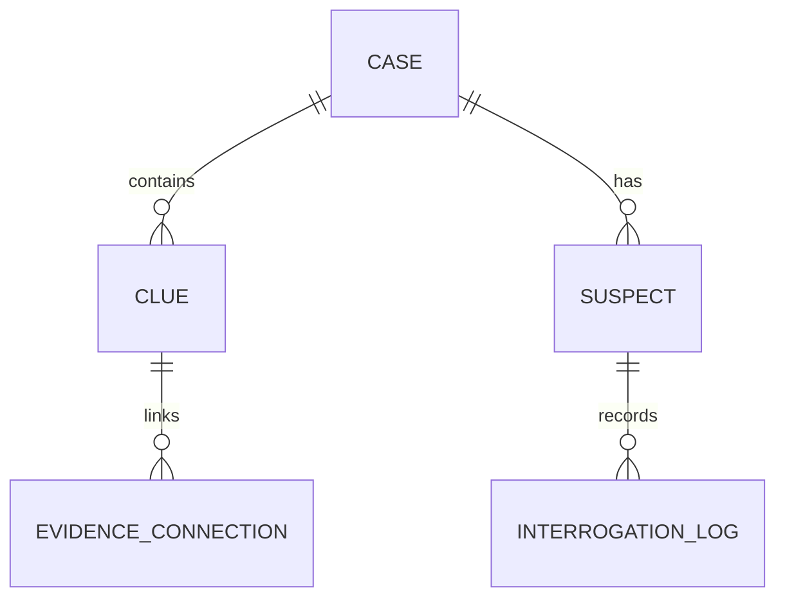

# 🕵️‍♂️ System Design: Blackbox Detective (AI Forensic Simulator)

This document outlines the architectural blueprints, database design, offline capabilities, and AI integrations for **Blackbox Detective**.

---

## 🏗️ 1. High-Level Architecture



---

## 💾 2. Local Database Design (SQLite)

We use **GRDB.swift** for a fast, type-safe SQLite layer. The tables must support complete offline navigation of evidence, clues, and unlocked cases.



### Table Schemas

#### `cases`
Stores the active case folders.
*   `id`: `TEXT` (UUID, Primary Key)
*   `title`: `TEXT`
*   `codename`: `TEXT` (e.g., "The Alchemist", "The Courier")
*   `summary`: `TEXT`
*   `status`: `TEXT` (Enum: `locked`, `active`, `solved`)
*   `unlocked_at`: `INTEGER` (Timestamp)

#### `clues`
Stores evidence assets like files, photos, audio transcripts, or background logs.
*   `id`: `TEXT` (UUID, Primary Key)
*   `case_id`: `TEXT` (Foreign Key -> `cases.id`)
*   `title`: `TEXT`
*   `type`: `TEXT` (Enum: `audio`, `document`, `image`, `metadata`)
*   `media_path`: `TEXT` (Local path relative to documents folder)
*   `transcript`: `TEXT` (For searchability & audio playback overlay)
*   `discovery_status`: `TEXT` (Enum: `hidden`, `unlocked`, `analyzed`)

#### `evidence_connections`
Manages the user-created "corkboard" links (the red strings).
*   `id`: `TEXT` (UUID, Primary Key)
*   `case_id`: `TEXT` (Foreign Key -> `cases.id`)
*   `source_clue_id`: `TEXT` (Foreign Key -> `clues.id`)
*   `target_clue_id`: `TEXT` (Foreign Key -> `clues.id`)
*   `connection_note`: `TEXT` (User notes on why these are connected)
*   `x_pos_source`: `REAL`, `y_pos_source`: `REAL` (For canvas rendering)
*   `x_pos_target`: `REAL`, `y_pos_target`: `REAL`

#### `suspects`
*   `id`: `TEXT` (UUID, Primary Key)
*   `case_id`: `TEXT` (Foreign Key -> `cases.id`)
*   `name`: `TEXT`
*   `photo_path`: `TEXT`
*   `alibi`: `TEXT`
*   `profile_notes`: `TEXT` (Updates as user uncovers clues)
*   `interrogation_limit`: `INTEGER` (Max questions allowed, e.g., 10)
*   `questions_asked`: `INTEGER` (Current question count)

#### `interrogation_logs`
*   `id`: `TEXT` (UUID, Primary Key)
*   `suspect_id`: `TEXT` (Foreign Key -> `suspects.id`)
*   `sender`: `TEXT` (Enum: `detective`, `suspect`)
*   `message`: `TEXT`
*   `timestamp`: `INTEGER`

---

## 🤖 3. Azure OpenAI Interrogation Integration

When online, interrogating a suspect initiates a structured API request. To ensure consistent behavior, we use **System Prompts** representing the suspect's psychological profile and specific knowledge boundaries.

### Interrogation Prompt Engineering
```json
{
  "system_prompt": "You are [Suspect Name], a highly intelligent [Profession/Role] suspected of collaborating with the primary criminal codenamed [Case Codename]. You are currently being interrogated by a federal agent.
  
  PSYCHOLOGICAL PROFILE:
  - Attitude: Defiant, calculating, highly articulate.
  - Secret: You know where the transaction took place, but you will only reveal it if the detective confronts you with evidence of the 'burn phone'.
  
  FACTUAL KNOWLEDGE (You only know this):
  - [Fact A]
  - [Fact B]
  
  INSTRUCTIONS:
  - Keep responses under 3 sentences.
  - Do not admit guilt easily.
  - Reference clues ONLY if the detective explicitly mentions them.",
  
  "temperature": 0.7,
  "max_tokens": 150
}
```
